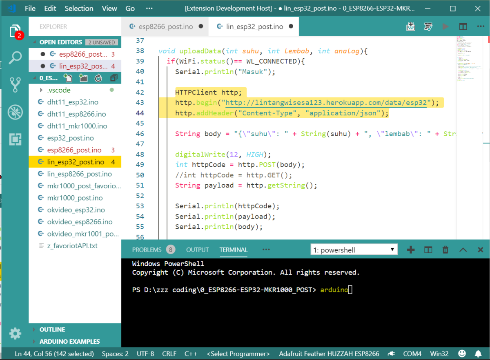
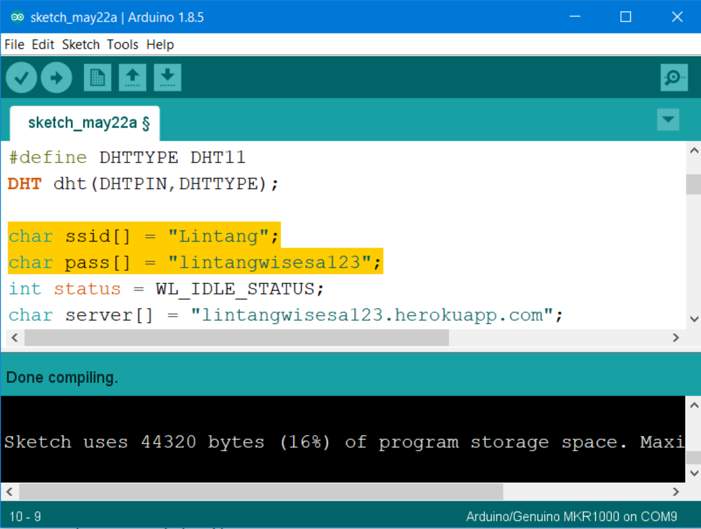

# VScode Theme Inspired by Arduino IDE

Hello, makers! Have you programmed your Arduino board through Visual Studio Code? I do all the time 😎 You can do a lot with VScode, including: selecting boards & ports, installing your lovely library, verify the sketches and uploading a program to an Arduino board. So I made this VScode theme, based on Arduino IDE design. Enjoy~ 🤩 

- Download theme: [VScode Arduino Theme](https://marketplace.visualstudio.com/items?itemName=lintangwisesa.arduino).
- Source code: [VScode Arduino Theme Source Code](https://github.com/LintangWisesa/VScode-Arduino-Theme).

#

## VScode Arduino Theme Preview 🔍

#

## Arduino IDE Preview 🔍

#### Lintang Wisesa :love_letter: _lintangwisesa@ymail.com_

[Facebook](https://www.facebook.com/lintangbagus) | 
[Twitter](https://twitter.com/Lintang_Wisesa) |
[Google+](https://plus.google.com/u/0/+LintangWisesa1) |
[Youtube](https://www.youtube.com/user/lintangbagus) | 
:octocat: [GitHub](https://github.com/LintangWisesa) |
[Hackster](https://www.hackster.io/lintangwisesa)